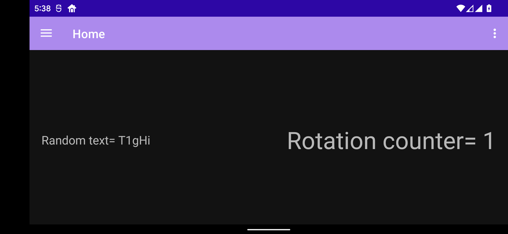

# MLB Android Challenge

The MLB Android development team had to deal in numerous occasions with difficult scenarios where we need to build the data that will be presented to the user from different data sources and coming in to the app at different times.

To complete this challenge you will need to keep attention to detail and dedicate enough time to try to understand the requirements before doing any coding. Another thing to keep an eye on is how data can be affected depending on the current state of application lifecycle and how can you get some leverage with tools like view models and live data.

## Challenge description

You are provided with the source code of an android application, the code is not complete and you will need to fill in the blanks to get the app to compile.

The app consists in a single activity hosting a single fragment, this fragment will present two different layouts for portrait and landscape orientations. In these layouts you notice that the portrait layout contains a single text view and the landscape layout contains 2 textviews.
Your goal is to complete the code to make the text views display a random string and the number of times the user has rotated their device.

 

### Requirements

Keeping in mind the lifecycle of a fragment, complete the code so the app will update the TextView(S) in the HomeFragment with the following format:

Random text = the generated random string Rotation counter = the number of times the user has rotated the device 

When a user rotates their device, a rotation counter should be increased by 1, update the UI when this happens. The random string generator function is already implemented, this function will generate a new string every 5 seconds, when that happens you will need to update the UI.

When any of the two values (rotation counter or random string generator) changes the value of one of the corresponding live data variables, you need to update the UI with the latest data.

### Hints

1.- The app is using the Jetpack navigation components to handle navigation, fix the navigation graph to direct the user to `HomeFragment` as the main and only destination.  
2.- Add and initialize the `HomeViewModel` inside the `HomeFragment`
3.- Keep track of the device orientation and make sure to react when you detect an orientation change.
4.- You want to start the random string generation as soon as the fragment is created.
5.- Don't change the layout files.
6.- Don't save variables in the fragment, use the view model for that.
